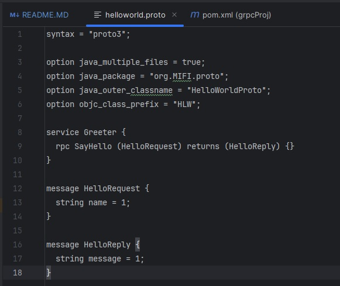

<details><summary>Использованные Maven зависимости</summary>
 
            <groupId>io.grpc</groupId>
            <artifactId>grpc-services</artifactId>
      
            <groupId>io.grpc</groupId>
            <artifactId>grpc-netty-shaded</artifactId>
            <scope>runtime</scope>
      
            <groupId>io.grpc</groupId>
            <artifactId>grpc-protobuf</artifactId>
       
            <groupId>io.grpc</groupId>
            <artifactId>grpc-stub</artifactId>
        
            <groupId>com.google.protobuf</groupId>
            <artifactId>protobuf-java-util</artifactId>
            <version>${protobuf.version}</version>
      
            <groupId>com.google.protobuf</groupId>
            <artifactId>protobuf-java</artifactId>
            <version>${protobuf.version}</version>
            
            <groupId>com.google.j2objc</groupId>
            <artifactId>j2objc-annotations</artifactId>
            <version>3.0.0</version>
  
            <groupId>javax.annotation</groupId>
            <artifactId>javax.annotation-api</artifactId>
            <version>1.3.2</version>
</details>


<details><summary>Плагин сборки proto файлов</summary>
<build>

org.xolstice.maven.plugins:protobuf-maven-plugin:0.6.1

com.google.protobuf:protoc:${protoc.version}:exe:windows-x86_64:grpc-java

io.grpc:protoc-gen-grpc-java:${grpc.version}:exe:windows-x86_64
</details>

Содержимое .proto файла




Клонируйте проект 
```shell
git clone https://github.com/JavaBruse/grpcProj.git
```
Для генерации файла протобаф и пересборки нужных файлов.
```shell
 mvn clean install
```
Все файлы сгенерирует плагин protobuf для java.

Собрать проект server
```shell
mvn package -Pserver
```
Собрать проект client
```shell
mvn package -Pclient
```
Упаковка в докер контейнеры клиента и сервера, и их запуска.
```shell
docker-compose up -d
```
Работу взаимодейтсвия можно увидеть в логах контейнеров. 

запускаеются 2 контейнера, в одном сервер, в другом клиент. 
Клиент непрерывно с таймаутом шлет сообщение на сервер, сервер отвечает.


Тут видно что контейнеры запущены в докере


Работа Сервера


Работа клиента
