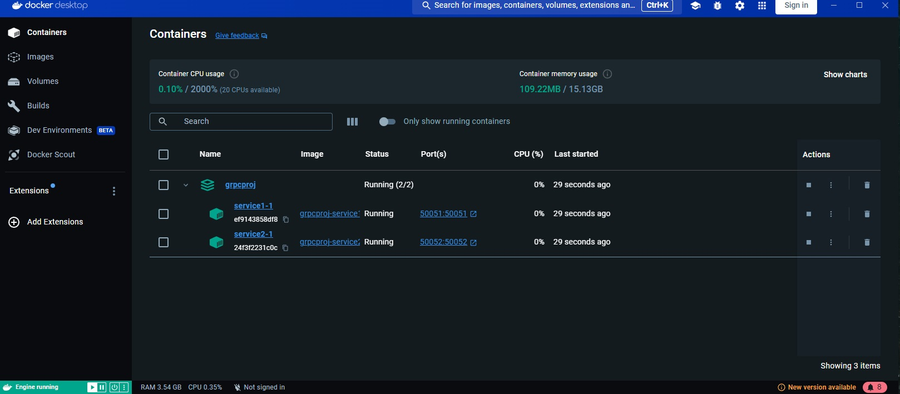
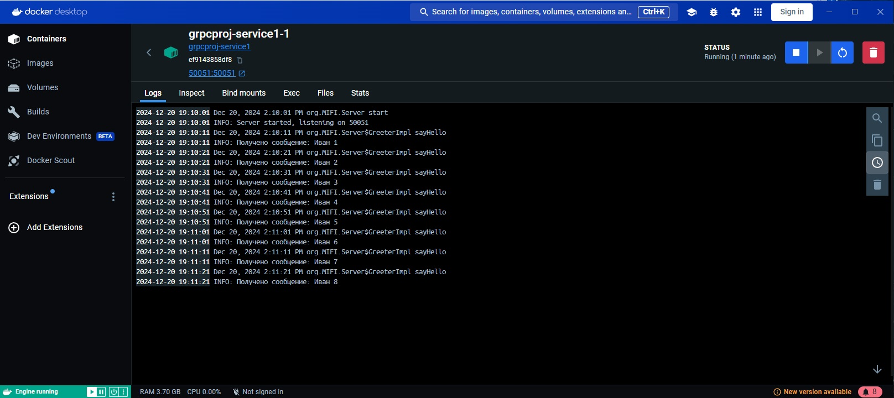
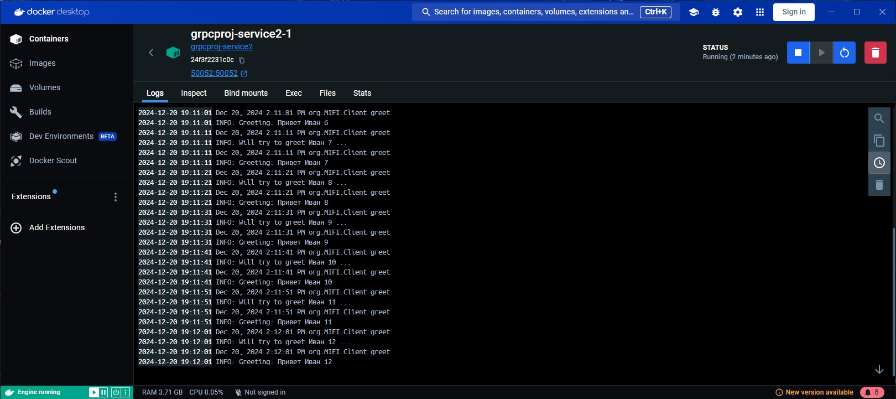

Клонируйте проект 
```shell
git clone https://github.com/JavaBruse/grpcProj.git
```
Для генерации файла протобаф и пересборки нужных файлов.
```shell
 mvn clean install
```
Все файлы сгенерирует плагин protobuf для java.

Собрать проект server
```shell
mvn package -Pserver
```
Собрать проект client
```shell
mvn package -Pclient
```
Упаковка в докер контейнеры клиента и сервера, и их запуска.
```shell
docker-compose up -d
```
Работу взаимодейтсвия можно увидеть в логах контейнеров. 

запускаеются 2 контейнера, в одном сервер, в другом клиент. 
Клиент непрерывно с таймаутом шлет сообщение на сервер, сервер отвечает.


Тут видно что контейнеры запущены в докере


Работа Сервера


Работа клиента
